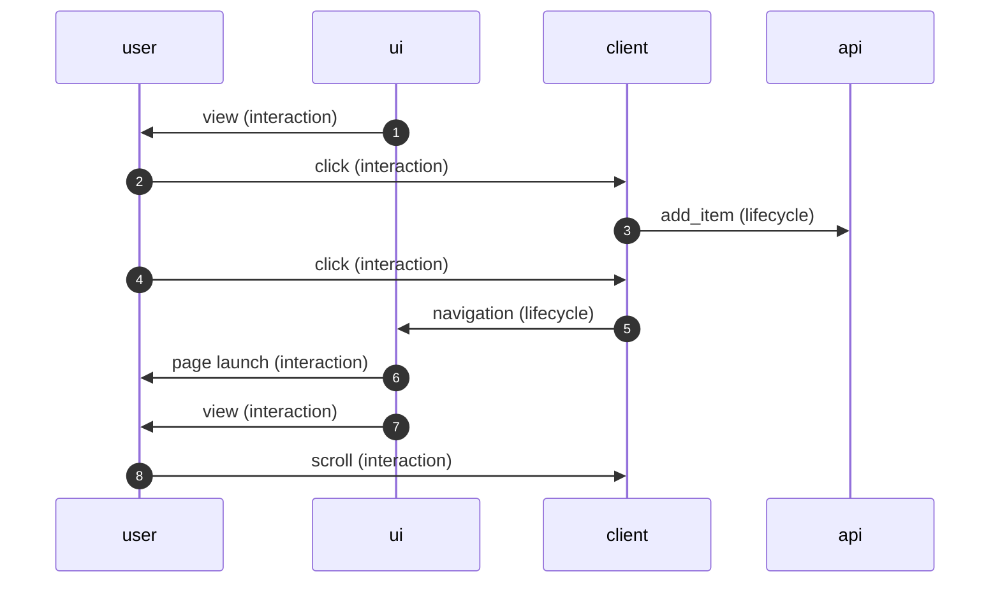

# Key Concepts

Below are the foundational concepts for `UnitifedTelemetry` events.

**Contents**

- [Event](#event)
- [UI Element](#ui-element)
- [Entity](#entity)
- [Enum](#enum)
- [Impression](#impression)
- [Session](#session)

---

## Event

Events are actions performed by users within the app or any other action on the client in response to user actions.

Head over to the [events][events] repository for more details.

### Raw Event

Raw events are emitted directly by the application through the `UnifiedTelemetry` SDK. Raw events fall into 2 categories:

1. [Interaction](#interaction-event)
2. [Lifecycle](#lifecycle-event)

#### Interaction Event

Capture the actions that users perform when interacting with the mobile or web app's interface, such as viewing, clicking, scrolling, or typing.

#### Lifecycle Event

Capture the state changes of an [Entity][common] in the app, such as adding items to cart, filtering, or searching. Lifecycle events can have a duration and error. Lifecycle events fall into 2 categories:

1. [Action](#action)
2. [Remote Action](#remote-action)

##### Action

Capture the state changes of an [Entity](#entity) that originate from the app, such as adding items to cart, filtering, or searching.

##### Remote action

Capture the state changes of an [Entity](#entity) that originate from the outside the app, such as pushing a notification or polling for a payment status.

### Aggregated Event

Aggregated events are computed, or derived, on top of raw events that occur in sequence or in relation to one another. For example, we combine a click event (interaction) with a navigation event (lifecycle) into a "click navigation" event, which captures a click that results in a page navigation.

## UI Element

### Page

A full screen container such as a screen or dialog/form that takes over interactions on the screen, aka. the primary surface. The dialog does not have to be full-screen, but it needs to be dismissed before the user can interact with another screen. For example, the DoubleDash screen can appear on top of a Store page, or contain another store page, but is not the primary surface. In this example, the DoubleDash screen is captured as a [`CxSectionType`][cx-section-type].

#### Examples

| ![home_page][page-type-home-page] | ![nv_store_page][page-type-nv-store-page] | ![global_search_page][page-type-global-search-page] |
|:--:|:--:|:--:|
| `page_type = 'home_page'` | `page_type = 'nv_store_page'` | `page_type = 'global_search_page'` |

### Section
A container of Views that allows user scroll interactions and has the concept of view position such as carousels, horizontal containers, or grids. Sections divide groupings of content on the Page.

#### Examples

| ![carousel.verticals][section-type-carousel] | ![collections.standard][section-type-collections] | ![search_autocomplete][section-type-search-autocomplete] |
|:--:|:--:|:--:|
| `section_type = 'carousel.verticals'` | `section_type = 'collections.standard'` | `section_type = 'search_autocomplete'` |

### View
A view component on the screen that represents an [Entity](#entity) such as a Store, Item, Banner, or Address. The one exception is buttons, which are treated as a View though they do not represent an Entity.

#### Examples

| ![carousel.verticals][section-type-carousel] | ![collections.standard][section-type-collections] | ![search_autocomplete][section-type-search-autocomplete] |
|:--:|:--:|:--:|
| `section_type = 'carousel.verticals'` | `section_type = 'collections.standard'` | `section_type = 'search_autocomplete'` |

## Entity

A key business object such as an Item, Store, or Cart, or a business concept with a unique data model such as Filters, Banners, or Campaigns. Entities have individual properties, for example a Store has an id, name, and vertical. Entities can have state changes based on the actions that users perform when interacting with the app such as adding items to Cart.

An [Entity](#entity) can be associated with a Page, Section, or View. For example the DoubleDash screen containing items from multiple Stores can appear on top of a Store page. In this example, the Store Entity is associated with the [Page](#page), and an Item Entity is associated with one or more [Views](#view) on the DoubleDash screen, which do not correspond to the same Store Entity of the Page.

Head over to the [common][common] repository for more details.

## Enum

In order to ensure consistency, we ensure that values for key [Event](#event) properties adhere to the specific constants, or allowed values, that are predefined. These enums are defined in the [sdks][implementation].

## Impression

An impression occurs whenever a user views a [View](#view) or [Page](#page) on the app.

### Viewability

An impression is considered viewable when *50%* of the View’s pixels are visible on the screen. This is denoted by `is_visible=true` in the [`CxView`][cx-view] event. Hidden, or non-visible, impressions are denoted by `is_visible=false`.

## Session

A session is the collection of all user events that take place within a given time frame or bounded context. Today, sessions are re-constructed on the data platform during processing. A session ends, or times, out after *30 minutes* of user inactivity. Events in the session are sequenced based on the order in which they are received from the client. We do not take into account whether the app is in the foreground or whether the same user navigates between platforms such as mobile web and app, however this is planned for the future.

[common]: https://github.com/doordash/services-protobuf/tree/master/protos/iguazu.cx/common/
[cx-section-type]: https://github.com/doordash/services-protobuf/tree/master/protos/iguazu.cx/common/cx_section_type.proto
[cx-view]: https://github.com/doordash/services-protobuf/tree/master/protos/iguazu.cx/events/cx_view.proto
[cx-view-impression-agg]: https://github.com/doordash/services-protobuf/tree/master/protos/iguazu.cx/events_agg_server/cx_view_impression_agg.proto
[events]: https://github.com/doordash/services-protobuf/tree/master/protos/iguazu.cx/events/
[implementations]: https://github.com/doordash/services-protobuf/tree/master/protos/iguazu.cx/README.md#implementations
[page-type-nv-store-page]: https://github.com/user-attachments/assets/dc6931fc-4e6f-481b-b627-3f68a36ab18c
[page-type-home-page]: https://github.com/user-attachments/assets/ba687994-6edf-462b-8180-df34011aac17
[page-type-global-search-page]: https://github.com/user-attachments/assets/f6661972-3bbc-4aaa-87f3-05594165f0d0
[section-type-carousel]: https://github.com/user-attachments/assets/
[section-type-collections]: https://github.com/user-attachments/assets/
[section-type-search-autocomplete]: https://github.com/user-attachments/assets/
