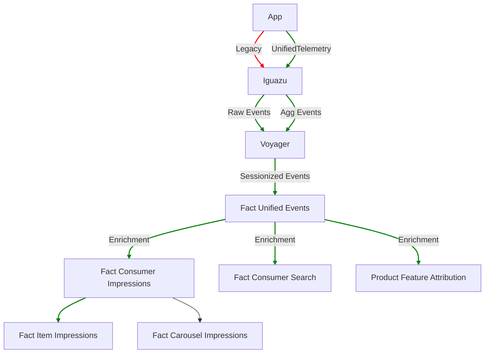

# Data Guide

`UnitifedTelemetry` data is available by default in Data Lake and Snowflake.

**Contents**

- [Coverage](#coverage)
- [Datasets](#datasets)
- [Dashboards](#dashboards)
- [Queries](#queries)

---

## Coverage

Below are the app surfaces that are currently covered by `UnitifedTelemetry`.

| Surface |  Description | Pages | Android| iOS | Web |
| :-----: | :----------- | :---- | :----: | :-: | :-: |
| Core Funnel | | | ✅ | ✅ | ✅ |
| Store Funnel | | | ✅ | ✅ | ✅ |
| Global Search | | | ✅ | ✅ | ✅ |
| In-Store Search | | | ✅ | ✅ | ✅ |
| Pickup | | | ✅ | ✅ | ✅ |
| Banners | | | ✅ | ✅ | ✅ |

## Datasets

| Dataset |  Description |
| :---: | :----------- |
| [`fact_consumer_events`][consumer-events] | cx_session event that is normalized for ease of use |
| [`fact_consumer_impressions`][consumer-impressions] | Curated dataset for View impression events |
| [`fact_consumer_impressions_ext`][consumer-impressions-ext] | [Enriched][#enrichment] View impression events |
| [`fact_consumer_sessions`][consumer-sessions] | Curated table that aggregates information at the session level |
| [`fact_search`][consumer-search] | Curated table that aggregates search related events at the search id level |
| [`fact_search_suggestions`][consumer-search-suggestions] | Curated table that aggregates search suggestion information at the search id level |
| [`fact_search_results`][consumer-search-results] | Curated table that aggregates search result information at the search id level |

### Enrichment

Curated datasets perform enrichment on raw event data by adding more information to improve its value and ease-of-use for analysis.

#### Entity Properties

The `UnifiedTelemetry` SDK collects _stateful_ information that records the value of an [Entity][entity] property at the time the event occurs. For example, the `cx_order_cart` entity reflects the state of the Cart at the time of the event, and its state changes as users update their Cart during the session.

Today, on the data platform we add, or append, _stateless_ information to Entities that are important for analytics use cases, which record the latest value at the time of event processing. For example, we add information associated with the Store such as the Store’s submarket.

## Dashboards

TODO

## Queries

Head over to the [queries][queries] guide for sample event queries.

[consumer-events]: https://datahub.doordash.team/dataset/urn:li:dataset:(urn:li:dataPlatform:snowflake,edw.consumer.fact_consumer_events,PROD)/Schema
[consumer-impressions]: https://datahub.doordash.team/dataset/urn:li:dataset:(urn:li:dataPlatform:snowflake,edw.consumer.fact_consumer_impressions,PROD)/Schema
[consumer-impressions-ext]: https://datahub.doordash.team/dataset/urn:li:dataset:(urn:li:dataPlatform:snowflake,edw.consumer.fact_consumer_impressions_ext,PROD)/Schema
[consumer-sessions]: https://datahub.doordash.team/dataset/urn:li:dataset:(urn:li:dataPlatform:snowflake,edw.consumer.fact_consumer_sessions,PROD)/Schema
[consumer-search]: https://datahub.doordash.team/dataset/urn:li:dataset:(urn:li:dataPlatform:snowflake,edw.consumer.fact_search,PROD)/Schema
[consumer-search-suggestions]: https://datahub.doordash.team/dataset/urn:li:dataset:(urn:li:dataPlatform:snowflake,edw.consumer.fact_search_suggestions,PROD)/Schema
[consumer-search-results]: https://datahub.doordash.team/dataset/urn:li:dataset:(urn:li:dataPlatform:snowflake,edw.consumer.fact_search_results,PROD)/Schema
[entity]: https://github.com/doordash/services-protobuf/tree/master/protos/iguazu.cx/docs/concepts.md#entity
[queries]: https://github.com/doordash/services-protobuf/tree/master/protos/iguazu.cx/docs/queries.md
