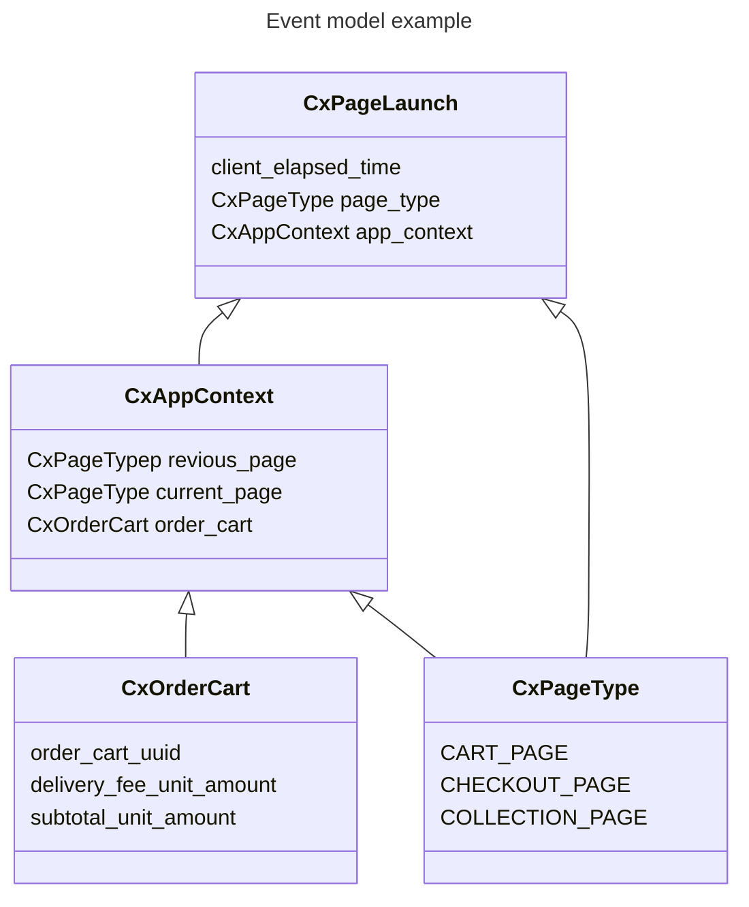

# Events

Events are actions performed by users within the app or any other action on the client in response to user actions.

**Contents**

- [Event Types](#event-types)
- [Protobuf Schemas](#protobuf-schemas)
- [Development](#development)

---

## Event Types

### Page (Interaction)

A page is any surface in the app. A "surface" is defined by app features as we consider as important product surface areas, e.g. a store page full screen, a item page dialog, etc. Pages do not have to be full-screens at DoorDash, and multiple pages can be visible to the user.

| Event | Description | How to Use | Data Catalog |
| ----- | ----------- | ---------- | ------------ |
| [cx_page_launch][cx-page-launch] | Surface launched. Indicates a page is about to become visible to the user. This event sets: `app_context:current:page` to the `page_type` value. | `page_type` is the identifier of the surface.  **How to look up:** `PageType` identifiers are stored in the [db]()  **How to add:** Define a new `PageType` enum value. Ensure the same value for the same surface on iOS/Android/Web | [📄][cx-page-launch-dc] |

### View (Interaction)

A view is the unit area which can be visible or clicked, eg. buttons, ads banners, item cards, store cards.

| Event | Description | How to Use | Data Catalog |
| ----- | ----------- | ---------- | ------------ |
| [cx_view][cx-view] | A view became visible or invisible. `is_visible` = true / false | `view_type`: the identifier of the view `section_type`: the scrollable section the view is in. `parent_view_type` is the parent view, e.g. `row.item` view that contains a `button.quantity_stepper` `entity_type`: the data entity associated with the view, e.g. item, store `entity_id`: the identifier of the entity, eg. for `store` this is `store_id`.   **How to look up:** ViewType identifiers are stored in the sdk  **How to add:** Define a new `CxViewType` enum value | [📄][cx-view-dc] |
| [cx_view_click][cx-view-click] | A view was clicked | Same as `cx_view` | [📄][cx-view-click-dc] |

### Section (Interaction)

A section is a container view, and contains multiple children, eg. a collection, header section. All scrollable containers are sections.

| Event | Description | How to Use | Data Catalog |
| ----- | ----------- | ---------- | ------------ |
| [`cx_section_view`][cx-section-view] | A container of views became visible or invisible, e.g. a collection | `section_type`: identifier of the section `entity_type`: data entity associated with the view, e.g. item, store `entity_id`: identifier of the entity, eg. for store this is store_id  **How to look up:** `SectionType` identifiers are stored in the [db]()  **How to add:** Define a new `CxSectionType` | [📄][cx-section-view-dc] |
| [`cx_section_click`][cx-section-click] | A container of views became visible or invisible, e.g. a collection | Same as `cx_section_view` | [📄][cx-section-click-dc] |

### Action (Lifecycle)

When a business or feature "entity" (aka data object) is changed in the app.

| Event | Description | How to Use | Data Catalog |
| ----- | ----------- | ---------- | ------------ |
| [`cx_action_page_load`][cx-action-page-load] | When data on a page is loaded. Changes the `app_context:xxx`, e.g. app_context:store | `action_type`: the specific kind of action `error`: the error that occurred. null if none `duration_ns`:the duration of the action, in nanoseconds | [📄][cx-action-page-load-dc] |
| [`cx_action_navigate`][cx-action-navigate]| When the app navigates to a different a dialog or screen, and `page_type` changes | Same as above | [📄][cx-action-navigate-dc] |
| [`cx_action_order_cart`][cx-action-order-cart] | Lifecycle | When `app_context:order_cart` is changed | Same as above | [📄][cx-action-order-cart-dc] |
| [`cx_action_search`][cx-action-search] | Search autocomplete or results change. When `app_context:search` is updated | Same as above | [📄][cx-action-search-dc] |
| [`cx_action_filter`][cx-action-filter] | Filter change on a filterable surface. When `app_context:selected_filters` is updated | Same as above | [📄][cx-action-filter-dc] |
| [`cx_action_sort`][cx-action-sort] | Sort order change on a sortable surface. When `app_context:selected_sort` is updated | Same as above | [📄][cx-action-sort-dc] |
| [`cx_action_category_l1`][cx-action-category-l1] | NV Category L1 change. When `app_context:category_l1` is changed | Same as above | [📄][cx-action-category-l1-dc] |
| [`cx_action_tab`][cx-action-tab] | When the bottom navigation tab is changed | TODO | [📄][cx-action-tab-dc] |
| [`cx_action_map_area`][cx-action-map-area] | When the map area on a map surface is changed | TODO | [📄][cx-action-map-area-dc] |

### Remote Action (Lifecycle)

When a business or feature “entity” (aka data) is changed outside of the app, and the app is notified by polling or by push notification.

| Event | Description | How to Use |
| ----- | ----------- | ---------- |
| [`cx_remote_action_payment_status`][cx-remote-action-payment-status] | When payment status is updated by polling. In Cx this indicates a checkout success | `action_type`: the specific kind of action, "edit_order" or "checkout" `status_type`:success or failure `error`: the error that occurred. null if none |

## Protobuf Schemas

### Best Practices

1. _Single Responsibility_ - Each event type should represent one clear action or state change to keep event handling simple and focused.
2. _Single-Field Messages_ - Avoid single-field messages by combining them with related messages unless they're expected to expand or are widely used across different contexts.

## Development

### Updating events

### Adding events

To define a new event, create a new `.proto` file with the event name and prefix `cx_`. The file name should correspond to the message name (eg. `cx_page_launch` containts `message CxPageLaunch`). **Note:** each file should contain a single event.

## Documentation

- [**Concepts**][concepts]: Key concepts.

- [**Migration**][migration]: Migration guide.

- [**Queries**][queries]: Sample event queries.

[cx-action-category-l1]: https://github.com/doordash/services-protobuf/protos/iguazu.cx/events/cx_action_category_l1.proto
[cx-action-category-l1-dc]: https://datahub.doordash.team/dataset/urn:li:dataset:(urn:li:dataPlatform:snowflake,iguazu.consumer.cx_action_category_l1,PROD)/Schema
[cx-action-filter]: https://github.com/doordash/services-protobuf/protos/iguazu.cx/events/cx_action_filter.proto
[cx-action-filter-dc]: https://datahub.doordash.team/dataset/urn:li:dataset:(urn:li:dataPlatform:snowflake,iguazu.consumer.cx_action_filter,PROD)/Schema
[cx-action-map-area]: https://github.com/doordash/services-protobuf/protos/iguazu.cx/events/pcx_action_map_area.proto
[cx-action-map-area-dc]: https://datahub.doordash.team/dataset/urn:li:dataset:(urn:li:dataPlatform:snowflake,iguazu.consumer.cx_action_map_area,PROD)/Schema
[cx-action-navigate]: https://github.com/doordash/services-protobuf/protos/iguazu.cx/events/cx_action_navigate.proto
[cx-action-navigate-dc]: https://datahub.doordash.team/dataset/urn:li:dataset:(urn:li:dataPlatform:snowflake,iguazu.consumer.cx_action_navigate,PROD)/Schema
[cx-action-order-cart]: https://github.com/doordash/services-protobuf/protos/iguazu.cx/events/cx_action_order_cart.proto
[cx-action-order-cart-dc]: https://github.com/doordash/services-protobuf/blob/master/protos/iguazu.cx/events/cx_action_order_cart.proto
[cx-action-page-load]: https://github.com/doordash/services-protobuf/protos/iguazu.cx/events/cx_action_page_load.proto
[cx-action-page-load-dc]: https://datahub.doordash.team/dataset/urn:li:dataset:(urn:li:dataPlatform:snowflake,iguazu.consumer.cx_action_page_load,PROD)/Schema
[cx-action-search]: https://github.com/doordash/services-protobuf/protos/iguazu.cx/events/cx_action_search.proto
[cx-action-search-dc]: https://datahub.doordash.team/dataset/urn:li:dataset:(urn:li:dataPlatform:snowflake,iguazu.consumer.cx_action_search,PROD)/Schema
[cx-action-sort]: https://github.com/doordash/services-protobuf/protos/iguazu.cx/events/cx_action_sort.proto
[cx-action-sort-dc]: https://datahub.doordash.team/dataset/urn:li:dataset:(urn:li:dataPlatform:snowflake,iguazu.consumer.cx_action_sort,PROD)/Schema
[cx-action-tab]: https://github.com/doordash/services-protobuf/protos/iguazu.cx/events/cx_action_tab.proto
[cx-action-tab-dc]: https://datahub.doordash.team/dataset/urn:li:dataset:(urn:li:dataPlatform:snowflake,iguazu.consumer.cx_action_tab,PROD)/Schema
[cx-page-launch]: https://github.com/doordash/services-protobuf/protos/iguazu.cx/events/cx_page_launch.proto
[cx-page-launch-dc]: https://datahub.doordash.team/dataset/urn:li:dataset:(urn:li:dataPlatform:snowflake,iguazu.consumer.cx_page_launch,PROD)/Schema
[cx-section-view]: https://github.com/doordash/services-protobuf/protos/iguazu.cx/events/cx_section_view.proto
[cx-section-view-dc]: https://datahub.doordash.team/dataset/urn:li:dataset:(urn:li:dataPlatform:snowflake,iguazu.consumer.cx_section_view,PROD)/Schema
[cx-section-click]: https://github.com/doordash/services-protobuf/protos/iguazu.cx/events/cx_section_click.proto
[cx-section-click-dc]: https://datahub.doordash.team/dataset/urn:li:dataset:(urn:li:dataPlatform:snowflake,iguazu.consumer.cx_section_view_click,PROD)/Schema
[cx-view]: https://github.com/doordash/services-protobuf/protos/iguazu.cx/events/cx_view.proto
[cx-view-dc]: https://datahub.doordash.team/dataset/urn:li:dataset:(urn:li:dataPlatform:snowflake,iguazu.consumer.cx_view,PROD)/Schema
[cx-view-click]: https://github.com/doordash/services-protobuf/protos/iguazu.cx/events/cx_view_click.proto
[cx-view-click-dc]: https://datahub.doordash.team/dataset/urn:li:dataset:(urn:li:dataPlatform:snowflake,iguazu.consumer.cx_view_click,PROD)/Schema
[concepts]: https://github.com/doordash/services-protobuf/tree/master/protos/iguazu.cx/docs/concepts.md
[migration]: https://github.com/doordash/services-protobuf/tree/master/protos/iguazu.cx/docs/migration.md
[queries]: https://github.com/doordash/services-protobuf/tree/master/protos/iguazu.cx/docs/queries.md
